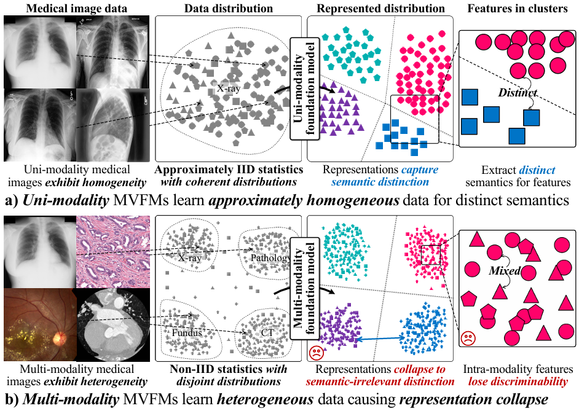
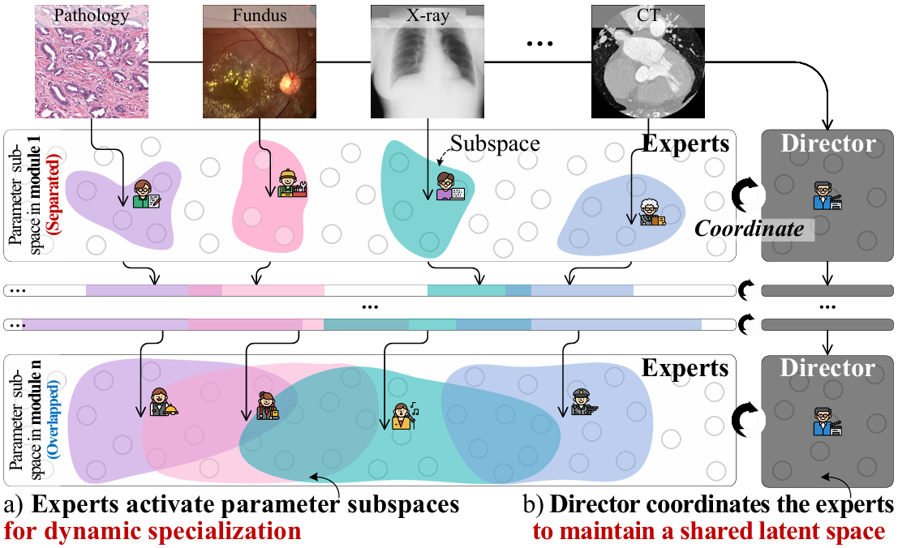
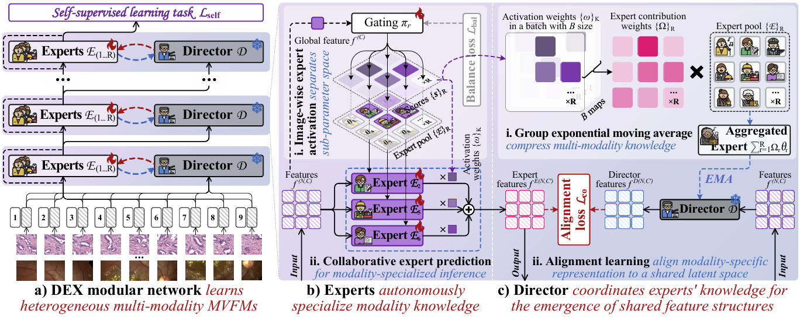

[](https://arxiv.org/abs/2605.21861)
---
[](https://arxiv.org/abs/2605.21861)
[]()
[](https://huggingface.co/datasets/YutingHe-list/MedVerse)

---

> **[Learning Emergent Modular Representations in Multi-modality Medical Vision Foundation Models.](https://arxiv.org/abs/2605.21861)**,<br/> 
> [Yuting He](https://yutinghe-list.github.io/), [Chenyu You](https://chenyuyou.me/), [Shuo Li](https://engineering.case.edu/about/school-directory/shuo-li),<br/> 
> In: ACM KDD, 2026

## 🧭 1. News

- 2026.05: **DEX** paper has been accepted by SIGKDD 2026 [[Paper](https://arxiv.org/abs/2605.21861)]
- 2026.05: **TAMP** has been released! Welcome to use!

## 🔍 2. Research Problem
Multi-modality medical vision foundation models are expected to learn universal representations across diverse imaging modalities, but heterogeneous medical images exhibit strong Non-IID statistics due to different imaging physics, resolutions, and acquisition protocols. When trained with a monolithic self-supervised objective, these conflicting modality distributions can cause gradient interference and representation collapse toward modality-dominant shortcuts, limiting the model’s transferability across clinical tasks.

<p align="center">

## ✨ 3. Brief introduction

Multi-modality medical vision foundation models (MVFMs) aim to learn universal representations across heterogeneous clinical imaging modalities. However, the pronounced Non-IID statistics among modalities lead to conflicting gradients and modality-dominant representation collapse, limiting cross-modality generalization. We propose **D**irector-**EX**perts (**DEX**), a modular network for general-purpose multi-modality medical vision representation learning. DEX balances expert specialization and director coordination to learn emergent modular representations from heterogeneous medical images. Pre-trained on **MedVerse**, a large-scale benchmark with over 4 million images across 10 modalities, DEX directly generalizes to diverse downstream tasks and achieves strong transferability across 26 clinical applications.

<p align="center">

## 🧩 4. The DEX Framework (Director-EXperts)

A modular representation learning framework that reformulates the backbone into stacked DEX modules:

* ⚖️ **Problem Formulation** — Decomposes multi-modality representation learning into two coupled dynamics: expert specialization for modality-specific features and director coordination for shared semantic alignment.
* 🧠 **Experts Specialize Modality Knowledge** — Uses image-wise expert activation to select modality-aware expert subspaces from global image features, enabling collaborative prediction while reducing cross-modality interference.
* 🎯 **Director Coordinates Shared Feature Structure** — Aggregates expert knowledge through Group Exponential Moving Average (GEMA) and aligns expert outputs to a shared latent space for cross-modality integration.
* 🏗️ **DEX Modular Network Architecture** — Hierarchically stacks DEX modules with self-supervised, alignment, and balance losses, progressively evolving modality-specific features into generalizable modular representations.

<p align="center">

## 💡 TL;DR

> **DEX = Monolithic Backbone → Director-Experts Modular Network**
> From “one shared model learns all modalities” → **“experts specialize, director coordinates.”**
>
> ✔️ Non-IID-aware
> ✔️ Modality-specialized
> ✔️ Cross-modality transferable
> ✔️ Emergent modular representation learning

---

## 💡 Reference
If you use this code or use our pre-trained weights for your research, please cite our papers:
```
@InProceedings{he2026learning,
  title={Learning Emergent Modular Representations in Multi-modality Medical Vision Foundation Models},
  author={He, Yuting and You, Chenyu and Li, Shuo},
  booktitle = {Proceedings of the 32nd ACM SIGKDD Conference on Knowledge Discovery and Data Mining},
  year={2026}
}
```

## 🛣️ Ongoing

- [ ] Release pre-training weights of DEX.
- [x] Release pre-training and adaptation codes of DEX.
- [x] Release MedVerse dataset with 4.97 million multi-modality images.

## 💖 Acknowledgements

We’d like to express our sincere gratitude to everyone who contributed to the development of **DEX**. This work was supported by computational resources provided through [**ACCESS**](https://allocations.access-ci.org/) and the [**Jetstream2** cloud system](https://jetstream2.exosphere.app/exosphere/). Thanks collaborators & students for countless hours spent on code review, data preparation, and visualization. We also thank the **open-source community** for building the foundations that made DEX possible. Finally, a heartfelt thanks to everyone who stars ⭐ this repository and shares feedback — your support fuels our research and helps push self-supervised medical AI forward!


